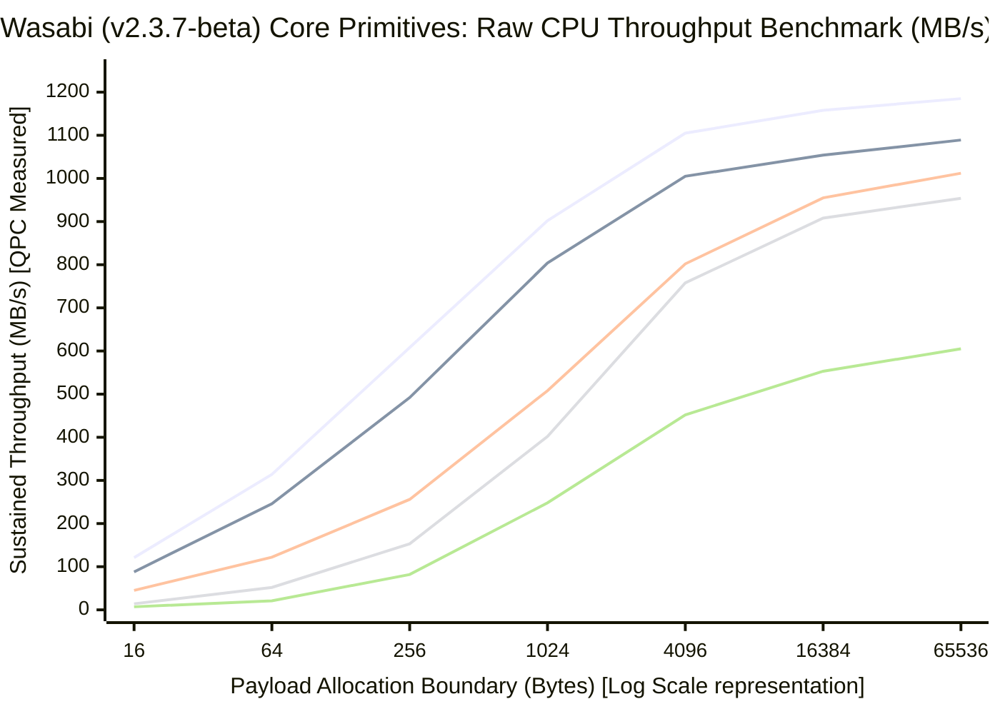

<div align="center">
  
</div>

<h1 align="center">Wasabi — VBA WebSocket & TCP</h1>

<p align="center">
  <b>Real-time WebSocket, MQTT, and raw TCP for Microsoft Office. No dependencies, no COM, no installs.</b>
</p>

<p align="center">
  
  
  
  
  
  
  
  
  
  
  
  <a href="https://github.com/sancarn/awesome-vba">
    
  </a>
</p>

<h2 align="center">Trusted by the VBA Community</h2>

<p align="center">
  <a href="https://github.com/EagleAglow">
    
  </a>
  <a href="https://github.com/wqweto">
    
  </a>
  <a href="https://github.com/Maatooh">
    
  </a>
  <a href="https://github.com/PerditionC">
    
  </a>
  <a href="https://github.com/Sven-Bo">
    
  </a>
  <a href="https://github.com/DecimalTurn">
    
  </a> <br/>
  <a href="https://github.com/sancarn">
    
  </a>
</p>

<p align="center">
  <sub>
    Recognition from developers behind <br/>
    influential VBA/VB6 systems, and/or low-level infrastructure projects.
  </sub>
</p>

<h3 align="center">Born in r/vba</h3>

<p align="center">
  <sub>
    Wasabi was first announced and grew alongside the amazing community at <b>r/vba</b> <br/>
    after years of research and development.
  </sub>
</p>

<p align="center">
  <a href="https://www.reddit.com/r/vba/">
    
  </a>
</p>

> [!NOTE]
> **Supported Applications**
>
> 
> 
> 
> 
> 
> **and any**  **VBA host**

> [!IMPORTANT]
> **Platform**
>
> 
> Currently available only on **Windows**, as it relies on Windows-specific APIs (`ws2_32`, `secur32`, `crypt32`, `advapi32`, `kernel32`).

## Table of Contents

- [What is Wasabi](#what-is-wasabi)
- [Repository Layout](#repository-layout)
- [Quick Start](#quick-start)
- [Architecture](#architecture)
  - [Why a Standard Module](#why-a-standard-module-bas-instead-of-classes-cls)
  - [Assembly Engine](#the-assembly-engine-thunks)
  - [Modular Design](#modular-design-dumb-pipe--extensions)
  - [Execution Model](#execution-model-single-thread-polling-and-async)
- [Features](#features)
  - [Middleware Pipeline](#the-middleware-pipeline)
  - [Protocol and Compression Extensions](#protocol-and-compression-extensions)
- [Examples](#examples)
- [Performance](#performance)
- [Compatibility](#compatibility)
- [Use Cases](#use-cases)
- [Roadmap](#roadmap)
- [Community & Acknowledgements](#community--acknowledgements)
- [Research](#research)
- [Stargazers over time](#stargazers-over-time)
- [Contributing](#contributing)
- [Security](#security)
- [License](#license)

## What is Wasabi

Wasabi is a single, self-contained `.bas` module that brings real-time networking to any Microsoft Office VBA host. It was designed to feel familiar to developers who have worked with [socket.io](https://socket.io) in Node.js, but runs entirely inside the Office ecosystem with no external runtimes, no COM registration, and no installers.

A single file drop into any VBA project is all it takes. No references need to be enabled in **Tools → References**.

Beyond WebSocket, Wasabi ships a full MQTT client with MQTT 5 extensions (User Properties, Reason Codes, metadata handling), a first-class raw TCP client, NTLM/Kerberos proxy authentication, RTT latency measurement, fine-grained TLS certificate control, a composable middleware pipeline, a pluggable compression architecture, and a `WSAAsyncSelect`-based event-driven async system that fires callbacks while Excel is idle without any polling loop. The module compiles cleanly on 32-bit and 64-bit Office hosts, from Windows XP to Windows 11, through conditional compilation (`#If VBA7`).

## Repository Layout

Every directory except `Wasabi.bas` itself is auxiliary. If you only want to use the library, importing the single `.bas` file is sufficient. The subdirectories exist for contributors, extension authors, and anyone studying the internals.

## Quick Start

### Import

[Download the latest release](../../releases) and import `Wasabi.bas` into your VBA project via **File → Import File** in the VBA editor.

### Connect and Send a Message

```vb
Dim h As Long

If WebSocketConnect("wss://echo.websocket.org", h) Then
    WebSocketSendText "Hello, Wasabi!", h

    Dim msg As String
    msg = WebSocketReceiveText(h)

    If msg <> "" Then
        Debug.Print "Received: " & msg
    End If

    WebSocketDisconnect h
End If
```

### Connect with TLS Certificate Validation

```vb
Dim h As Long

WebSocketSetCertValidation True, h
WebSocketSetRevocationCheck True, h

If WebSocketConnect("wss://example.com/ws", h) Then
    WebSocketSendText "Secure hello", h
    WebSocketDisconnect h
End If
```

### MQTT with QoS 2 and MQTT 5 User Properties

```vb
Dim h As Long

WebSocketConnect "wss://broker.hivemq.com:8443/mqtt", h, , , "mqtt"
WebSocketSetOfflineQueueing True, h

MqttConnect "WasabiClient_123", , , 60, h

' Publish with QoS 2 and attach a user property (MQTT 5 metadata)
MqttPublish "sensors/data", "Value: 42", 2, False, "source", "wasabi", h
```

### Connect Through a Proxy

```vb
Dim h As Long

' Hardcoded proxy or use WebSocketAutoDiscoverProxy()
WebSocketSetProxy "proxy.company.com", 8080, "user", "pass", 0, h
WebSocketSetProxyNtlm True, h

If WebSocketConnect("wss://example.com/ws", h) Then
    WebSocketSendText "Behind the firewall", h
    WebSocketDisconnect h
End If
```

### Auto-Reconnect with Keepalive and Ping Jitter

```vb
Dim h As Long

WebSocketSetAutoReconnect True, 5, 1000, h
WebSocketSetPingInterval 30000, 5000, h  ' 30s interval, up to 5s of random jitter

If WebSocketConnect("wss://example.com/ws", h) Then
    Do While WebSocketIsConnected(h)
        Dim msg As String
        msg = WebSocketReceiveText(h)
        If msg <> "" Then Debug.Print "Received: " & msg
        DoEvents
    Loop
End If
```

### Event-Driven Async

Instead of polling in a loop, register a handler object and let Wasabi call your callbacks automatically while Excel is idle.

```vb
' In a standard module at module level
Private g_Handler As cMyHandler
Private g_Handle As Long

Public Sub StartAsync()
    Set g_Handler = New cMyHandler
    If WebSocketConnect("wss://stream.binance.com:9443/ws/btcusdt@trade", g_Handle) Then
        WasabiUseAsync g_Handler, g_Handle
        ' Sub ends here. Callbacks fire while Excel is idle.
    End If
End Sub
```

Handler class (`cMyHandler`):

```vb
Option Explicit

Public Sub OnConnect(ByVal handle As Long)
    Debug.Print "Connected. Handle: " & handle
End Sub

Public Sub OnReceive(ByVal handle As Long)
    Dim msg As String
    Do While WebSocketGetPendingCount(handle) > 0
        msg = WebSocketReceiveText(handle)
        Debug.Print "Received: " & msg
    Loop
End Sub

Public Sub OnReadyToSend(ByVal handle As Long)
End Sub

Public Sub OnClose(ByVal handle As Long)
    Debug.Print "Connection closed. Handle: " & handle
End Sub

Public Sub OnError(ByVal handle As Long, ByVal errorCode As Long, ByVal eventType As Long)
    Debug.Print "Error on handle " & handle & " | Code: " & errorCode
End Sub
```

> [!IMPORTANT]
> The handler object must be stored at module or workbook level, never as a local variable inside a `Sub`. Always call `WebSocketDisconnect` before resetting the VBA project or closing the workbook.

### Pluggable Compression

```vb
Dim h As Long

' Register any class implementing Deflate/Inflate
' ExtWasabiZlib.cls is the reference implementation, located in extensions/
Dim deflate As New ExtWasabiZlib
WasabiUseCompression deflate, h

If WebSocketConnect("wss://example.com/ws", h) Then
    Debug.Print "Compression active: " & WebSocketGetDeflateEnabled(h)
    WebSocketSendText "Compressed payload", h
    WebSocketDisconnect h
End If
```

> [!NOTE]
> Compression is fully opt-in and algorithm-agnostic. If no handler is registered, the connection proceeds normally without compression. The `permessage-deflate` reference implementation lives in [`extensions/ExtWasabiZlib.cls`](extensions/ExtWasabiZlib.cls); the required `zlib1.dll` binaries are in [`libs/`](libs/). Full setup instructions are in [`docs/DEFLATE.md`](docs/DEFLATE.md).

### Using the Middleware Pipeline

```vb
' MyLogger.cls
Public Sub OnBeforeSend(ByVal handle As Long, ByRef data() As Byte)
    Debug.Print "[OUT] " & UBound(data) + 1 & " bytes"
End Sub

Public Sub OnAfterReceive(ByVal handle As Long, ByRef data() As Byte)
    Debug.Print "[IN]  " & UBound(data) + 1 & " bytes"
End Sub

Public Sub OnConnect(ByVal handle As Long): End Sub
Public Sub OnDisconnect(ByVal handle As Long): End Sub
```

```vb
Dim h As Long
Dim logger As New MyLogger

WasabiUseMiddleware logger, h

If WebSocketConnect("wss://example.com/ws", h) Then
    WebSocketSendText "Instrumented message", h
    WebSocketDisconnect h
End If
```

### Raw TCP (plain and TLS)

```vb
' Plain TCP with delimiter-based read
Dim h As Long

If TcpConnect("tcpbin.com", 4242, h) Then
    TcpSendText "hello" & vbCrLf, h

    Dim line As String
    line = TcpReceiveUntil(vbCrLf, 3000, h)
    Debug.Print "Echo: " & line

    TcpDisconnect h
End If
```

```vb
' TCP with TLS (full Schannel stack)
Dim h As Long

If TcpConnectTLS("example.com", 443, h) Then
    TcpSendText "GET / HTTP/1.0" & vbCrLf & "Host: example.com" & vbCrLf & vbCrLf, h

    Dim t As Long, msg As String
    t = GetTickCount()
    Do While TickDiff(t, GetTickCount()) < 5000
        msg = TcpReceiveText(h)
        If Len(msg) > 0 Then Exit Do
        DoEvents
    Loop

    Debug.Print Left(msg, 200)
    TcpDisconnect h
End If
```

For the complete API reference with all parameters, return values, and usage notes, see [`docs/API_REFERENCE.md`](docs/API_REFERENCE.md).

## Architecture

### Why a Standard Module (.bas) instead of Classes (.cls)?

This is a deliberate design choice, not a limitation. Several concrete constraints of the VBA environment make a procedural standard module the right tool for networking at this level.

**Zero COM overhead.** Every VBA class is a COM object. Instantiating it, dispatching method calls through `IDispatch`, and managing reference counts all add overhead that accumulates when processing frames at high frequency. A standard `.bas` module communicates directly with the CPU and memory, bypassing the COM layer entirely.

**Static connection pool and data-oriented design.** Wasabi manages up to 64 concurrent connections using a statically allocated pool of User-Defined Types (`WasabiConnection`). All connection state lives in a contiguous block of memory rather than objects scattered across the heap. This is more cache-friendly and eliminates heap fragmentation in long-running Office sessions.

**Native Win32 API alignment.** Low-level networking requires heavy use of memory pointers (`StrPtr`, `VarPtr`) and direct memory manipulation (`RtlMoveMemory`). Standard modules provide a flatter memory model for passing data to Windows Kernel and Security APIs. Passing class properties to Win32 APIs often requires temporary copies; procedural modules allow in-place processing, which is essential for the zero-copy receive model.

**Minimal integration friction.** State is managed globally through a simple integer handle. There are no object lifecycles to manage and no risk of a variable falling out of scope and silently terminating a live connection.

**Developer experience.** The global scope of standard modules exposes public enums (`WasabiState`, `WasabiConnectionMode`, `WasabiError`) and types (`WasabiStats`) everywhere in the project without instantiating anything, with full IntelliSense support. Functions like `WebSocketGetLastError` return specific `WasabiError` enum values, enabling clean `Select Case` blocks and self-documenting error handling.

> [!TIP]
> This architecture transforms Wasabi from a simple script into a high-performance networking engine, bringing C-level memory management and stability to the VBA ecosystem.

### The Assembly Engine (Thunks)

<div align="center">
  
</div>

VBA is an interpreted language that excels at COM automation but is inherently slow at processing large byte arrays sequentially, because every loop iteration carries bounds-checking and variant type conversion overhead. For operations like masking WebSocket frames or scanning megabyte-sized TCP buffers for delimiters, this is unacceptable.

Wasabi solves this with **safe thunks**: compiled machine code (x86 and x64) injected into executable memory at runtime and invoked through `CallWindowProcW`.

**How it works:**

1. On initialization, `VirtualAlloc` requests a block of memory with `PAGE_EXECUTE_READ` permissions.
2. The raw opcode bytes for each thunk are copied into that block via `RtlMoveMemory`.
3. When a heavy byte-level operation is needed, `CallWindowProcW` executes the block as if it were a native C function.

**The four thunks Wasabi ships:**

`ws_mask` applies the mandatory WebSocket XOR mask (RFC 6455) to outbound frames. It eliminates the VBA loop bottleneck entirely, allowing megabytes of payload to be masked in microseconds.

`mem_zero` is a hardware-level memory wipe using the `rep stosb` instruction. Called during connection cleanup to securely erase decrypted payloads, TLS buffers, and proxy credentials from RAM.

`mem_find` is hardware-accelerated byte-pattern matching using `repe cmpsb`. It locates delimiters such as `\r\n` inside massive TCP buffers instantly. This thunk is also the engine behind `TcpReceiveUntil`.

`tick_diff` is a lightweight counter helper used for timeout and latency calculations, handling `GetTickCount` overflow correctly.

**Calling conventions:** x64 uses the Microsoft x64 convention (arguments in `RCX`, `RDX`, `R8`, `R9`). x86 uses `stdcall` (arguments pushed to the stack, cleaned with `ret 16`).

The original NASM/FASM source for all thunks, with full comments and compilation instructions, lives in [`dev/asm/`](dev/asm/).

### Modular Design: Dumb Pipe + Extensions

Wasabi is built on strict separation of concerns across four layers.

**Raw Transport (Dumb Pipe).** Manages TCP sockets, TLS via Schannel, Happy Eyeballs (RFC 6555), and proxy authentication. Treats the connection as a raw byte stream with no knowledge of any protocol.

**Protocol Layer.** Injected via `WasabiUseProtocol`. Handles WebSocket framing, MQTT message parsing, or any custom binary or text protocol. The engine dispatches parsed messages to the registered handler. MQTT support is built-in and uses this slot internally.

**Middleware Layer.** Registered via `WasabiUseMiddleware`. Intercepts every byte flowing inbound and outbound. Multiple middleware objects are chained in registration order. Ideal for logging, encryption, HMAC signing, or metrics collection without touching application code.

**Compression Layer.** Registered via `WasabiUseCompression`. Any class implementing `Deflate` and `Inflate` methods can be plugged in. The core module has no dependency on any compression library and only calls this interface if a handler is registered. The reference implementation is [`extensions/ExtWasabiZlib.cls`](extensions/ExtWasabiZlib.cls).

This separation means security patches, protocol additions, and algorithm changes are confined to isolated components, without ever requiring a fork of the main module.

### Execution Model: Single-Thread, Polling, and Async

VBA is single-threaded. One execution thread is shared between your code and the Office UI, so there is no native background socket listener.

**Polling model.** Incoming messages accumulate in an internal ring buffer (up to 512 messages) and are delivered when you call `WebSocketReceiveText`. Each call runs keepalive maintenance (pings, inactivity timeout, MTU probes), checks the OS socket buffer via `FIONREAD`, reads available data, decrypts if TLS is active, parses WebSocket frames, runs all registered inbound middleware, and returns the oldest queued message. Between calls, the kernel continues buffering incoming data. No messages are lost and the connection does not drop regardless of polling frequency. Simple send/receive/disconnect workflows work fine without any loop. For live dashboards and reactive scenarios, the recommended polling pattern is `Application.OnTime`.

**Async model.** Wasabi also supports a fully event-driven mode via `WasabiUseAsync`. Under the hood it uses `WSAAsyncSelect` to register the socket with a hidden Win32 window, and a native machine-code thunk subclasses that window to dispatch `FD_READ`, `FD_WRITE`, `FD_CLOSE`, and `FD_CONNECT` events to your handler object. Callbacks fire while Excel is idle without any polling loop on your part. If your code is running a tight loop without `DoEvents`, messages queue in the Windows message pump and are delivered as soon as your code finishes or yields. The async thunk includes a VBA runtime liveness guard that falls back to `DefWindowProcW` if the project has been reset, preventing crashes. See [`docs/API_REFERENCE.md`](docs/API_REFERENCE.md) for the full async callback contract and usage notes.

## Features

### The Middleware Pipeline

Any VBA class implementing the following four methods can be registered as middleware:

```vb
Public Sub OnBeforeSend(ByVal handle As Long, ByRef data() As Byte)
Public Sub OnAfterReceive(ByVal handle As Long, ByRef data() As Byte)
Public Sub OnConnect(ByVal handle As Long)
Public Sub OnDisconnect(ByVal handle As Long)
```

Multiple middleware objects can be chained on the same handle and are executed in registration order for both inbound and outbound data:

```vb
Dim logger As New MyLoggingMiddleware
Dim encryptor As New MyEncryptionMiddleware

WasabiUseMiddleware logger, h
WasabiUseMiddleware encryptor, h
```

Typical uses include transparent byte logging, custom payload encryption or HMAC signing before frames leave the socket, custom compression schemes, and byte counters or message-rate metrics without polluting application code.

### Protocol and Compression Extensions

**Protocol Handler (`WasabiUseProtocol`).** A single object that receives parsed text and binary messages after the WebSocket frame layer has processed them. This is the cleanest integration point for application-level protocols without touching the transport engine.

```vb
Dim myProto As New MyMqttProtocol
WasabiUseProtocol myProto, h
```

**Compression Handler (`WasabiUseCompression`).** An object implementing `Deflate` and `Inflate`. This slot replaces the built-in compression path, allowing any algorithm such as LZ4, Brotli, or Zstandard to be supplied without modifying the core module. The `permessage-deflate` reference implementation is [`extensions/ExtWasabiZlib.cls`](extensions/ExtWasabiZlib.cls), which depends on the `zlib1.dll` binaries in [`libs/`](libs/).

```vb
Dim lz4 As New MyLZ4Compressor
WasabiUseCompression lz4, h
```

Both extensions receive `OnConnect` and `OnDisconnect` lifecycle callbacks automatically.

## Examples

Ready-to-run `.bas` modules and `.xlsm` workbooks covering the most common production patterns are in [`examples/`](examples/).

[Explore the Examples Suite](examples/)

## Performance

All cryptographic and encoding primitives are delegated to native Windows APIs (`advapi32.dll`, `crypt32.dll`), and intensive byte processing is routed directly to the CPU via the Assembly Engine. This yields throughput close to the hardware limit even inside the interpreted VBA runtime.



> The chart plots throughput against payload size on a logarithmic scale, highlighting the performance variance between memory scanning, string encoding, and raw framing operations.

> [!NOTE]
> SHA-1 now runs at **182.8 MB/s** (down from 1.42 s per 128 KB in pure VBA). Base64 operations stay around **41 MB/s**, UTF-8 conversion exceeds **1 GB/s**, and WebSocket frame construction tops **25 MB/s**. The test harness and raw measurement data are in [`benchmark/`](benchmark/).

### Stress Test Results

The engine was subjected to a continuous, single-threaded stress test handling over 10 MB of concurrent traffic, cryptographic masking, and hardware-level buffer scanning, all on a standard Office VBA thread.

| Transport Layer | Payload / Operation | Execution Time | Throughput / Notes |
| :--- | :--- | :--- | :--- |
| **TCP TLS (Schannel)** | DNS + mTLS Handshake + HTTP GET | `656 ms` | Native C-level latency (Happy Eyeballs IPv6) |
| **TCP Raw** | 10x `TcpReceiveUntil` (`\r\n`) buffer scans | `5156 ms` | Instant `mem_find` hardware delimiter scan |
| **WSS Deflate** | 100x 100KB payloads (10 MB Total) | `4469 ms` | ~2.2 MB/s with inline ASM XOR masking |
| **MQTT 5 (QoS 2)** | Subscribe + 50x QoS 2 Publishes | `1219 ms` | Flawless In-Flight queue & metadata handling |

## Compatibility

Wasabi uses only native Windows DLLs present on every version of Windows since XP: `ws2_32.dll`, `secur32.dll`, `kernel32.dll`, `advapi32.dll`, and `crypt32.dll`. No third-party installers, no COM registration, no ActiveX controls, no Python runtime, no .NET packages. Dropping the `.bas` file into a VBA project is all it takes.

Many competing modules depend on `WinHttpWebSocket*` functions introduced in Windows 8, which causes silent failures on Windows 7 machines that remain common in corporate and industrial environments. Wasabi has no such limitation.

### Operating System

| Version | Support |
|---|---|
|  Windows XP |  |
|  Windows Vista |  |
|  Windows 7 |  |
|  Windows 8 / 8.1 |  |
|  Windows 10 |  |
|  Windows 11 |  |

### Office and VBA Host

| Environment | Support |
|---|---|
|  Excel 32-bit |  |
|  Excel 64-bit |  |
|  Word 32-bit |  |
|  Word 64-bit |  |
|  PowerPoint 32-bit |  |
|  PowerPoint 64-bit |  |
|  Access 32-bit |  |
|  Access 64-bit |  |
|  Any VBA7 host (Office 2010+) |  |
|  VBA6 (Office 2007 and earlier) |  |

32-bit and 64-bit compatibility is handled transparently through `#If VBA7` conditional compilation across all API declarations. The same `.bas` file compiles correctly on Office 2007 32-bit and Office 365 64-bit on Windows 11.

## Use Cases

**Bots and chat integrations.** Connect to Discord, Slack, or Telegram gateways and handle real-time events directly from Excel or Word.

**Trading and finance.** Stream live market data from exchanges like Binance, Coinbase, or B3 into spreadsheet cells with millisecond-level latency.

**Live dashboards.** Update cells in real time without manual refreshes or HTTP polling.

**IoT and industrial SCADA.** Receive sensor data from ESP32, Raspberry Pi, or PLC systems via WebSocket or MQTT natively into Office.

**Corporate automation.** Connect Office to internal WebSocket APIs behind firewalls and NTLM/Kerberos proxies without requiring IT to install third-party software.

**Raw TCP automation.** Communicate directly with legacy PLC systems, industrial equipment, SMTP servers, or custom binary protocols that do not speak WebSocket or HTTP.

**Custom protocol engines.** Use the Protocol Handler and Middleware slots to implement proprietary binary protocols cleanly on top of the Wasabi transport layer.

## Roadmap

###  Completed

- [x] IPv6 and SNI support
- [x] Mutual TLS (mTLS) for client certificate authentication via PFX or system certificate store
- [x] SOCKS5 proxy support
- [x] HTTP/2 upgrade via ALPN (opt-in)
- [x] NTLM/Kerberos authentication for HTTP proxies
- [x] **Windows System Proxy Auto-Discovery** (PAC scripts via `winhttp.dll`)
- [x] MQTT client (3.1.1 with **MQTT 5 extensions**): QoS 1 and **QoS 2 (Exactly Once)**, User Properties (`metaKey`/`metaValue`), Reason Codes, In-Flight queue with Packet ID tracking (PUBREC/PUBREL/PUBCOMP)
- [x] RTT latency measurement (`GetLatency`)
- [x] `permessage-deflate` compression (RFC 7692) via pluggable extension ([`extensions/ExtWasabiZlib.cls`](extensions/ExtWasabiZlib.cls))
- [x] Zero-copy receive buffers and MTU-aware frame sizing
- [x] Send batching (text and binary)
- [x] Close frame payload parsing (code and reason)
- [x] Happy Eyeballs (RFC 6555)
- [x] Configurable CRL/OCSP certificate revocation checking
- [x] **Strict State Machine** (`STATE_CONNECTING`, `STATE_OPEN`, `STATE_CLOSING`, `STATE_CLOSED`)
- [x] **Offline Queueing**: messages sent during a disconnect are buffered and flushed on reconnect
- [x] **Ping Jitter**: pseudo-random variance on keepalive pings to avoid strict gateway filters
- [x] **Native TCP Client** (`TcpConnect`, `TcpConnectTLS`) sharing the full Schannel engine
- [x] TCP MTU discovery, `NoDelay`, inactivity timeout, and proxy support
- [x] **`TcpBroadcastBinary` / `TcpBroadcastText`**: send to all active TCP connections simultaneously
- [x] **`TcpReceiveUntil`**: delimiter-based blocking read powered by the `mem_find` ASM thunk
- [x] **Middleware Pipeline** (`WasabiUseMiddleware`)
- [x] **Protocol Handler** (`WasabiUseProtocol`) for pluggable application protocol injection
- [x] **Compression Handler** (`WasabiUseCompression`) for decoupled compression extensions
- [x] **Core Refactoring**: raw transport decoupled from protocol logic
- [x] **Modular Compression**: `zlib1.dll` dependency isolated into [`extensions/ExtWasabiZlib.cls`](extensions/ExtWasabiZlib.cls)
- [x] **Async Event-Driven Mode** (`WasabiUseAsync`): `WSAAsyncSelect`-based socket notifications with a native thunk dispatcher, eliminating polling loops

###  In Progress

Nothing currently in progress. Have an idea? [Open an issue](../../issues) or a [pull request](../../pulls).

## Community & Acknowledgements

Wasabi builds on years of experimentation and deep research into the internals of the VBA/VB6 low-level networking ecosystem. Every entry below represents a piece of the puzzle: a thread read at 2am, a gist bookmarked and studied line by line, a repository that answered a question nobody else was asking.

Special thanks to the developers and projects that helped inspire, inform, or directly shape Wasabi's architecture and engineering direction:

### Core Networking and WebSocket

-  [vba-websocket](https://github.com/EagleAglow/vba-websocket): The foundational discovery that made this entire space possible. A VBA WebSocket client implementation built on top of Microsoft's own WinHttp API, proving that WebSocket communication was achievable from inside Office by  [**EagleAglow**](https://github.com/EagleAglow)
-  [vba-websocket-async](https://github.com/EagleAglow/vba-websocket-async): The async companion to vba-websocket, pushing the concept further toward event-driven communication patterns inside a single-threaded runtime by  [**EagleAglow**](https://github.com/EagleAglow)
-  [VbAsyncSocket](https://github.com/wqweto/VbAsyncSocket): The most complete async networking foundation ever built for VB6/VBA. A thin WinSock2 wrapper with a full TLS 1.3/1.2 stack implemented in pure VB6 ASM thunks (no OpenSSL dependency), a native SSPI/Schannel backend, and a libsodium backend. Auto-detects AES-NI and PCLMULQDQ and switches to hardware-accelerated AES-GCM. Supports legacy OSes back to Windows NT 4.0 and Windows 98 by  [**wqweto**](https://github.com/wqweto)
-  [TlsSocketWSS-vb6](https://github.com/Maatooh/TlsSocketWSS-vb6): A TLS-enabled WebSocket implementation for VB6, one of the few projects tackling secure WebSocket at the transport layer directly from classic Visual Basic by  [**Maatooh**](https://github.com/Maatooh)
-  [vb6-websocket-server-ssl](https://github.com/JoshyFrancis/vb6-websocket-server-ssl): A secure WebSocket server implementation for VB6, flipping the usual client-only perspective and demonstrating server-side WebSocket handshake handling in the language by  [**JoshyFrancis**](https://github.com/JoshyFrancis)
-  [VBA_WinsockAPI_TCP_Sample](https://github.com/papanda925/VBA_WinsockAPI_TCP_Sample): Raw WinSock TCP experiments directly from VBA, calling WSA functions by hand without the Winsock control, a crucial reference for understanding what the socket layer actually looks like beneath all the abstractions by  [**papanda925**](https://github.com/papanda925)
-  [webxcel](https://github.com/michaelneu/webxcel): A fully RESTful HTTP web backend written entirely in VBA macros, built on Windows Sockets 2 and running on any Excel version from 2007 onward. A proof that VBA can be a web server by  [**michaelneu**](https://github.com/michaelneu)

### Subclassing, Hooking and Low-Level Windows Internals

-  [ModernSubclassingThunk](https://github.com/wqweto/ModernSubclassingThunk): The definitive solution for IDE-safe window subclassing, Windows hooks, and fire-once timers in VB6/VBA. Eliminates the End button crash entirely through machine code thunks embedded at runtime by  [**wqweto**](https://github.com/wqweto)
-  [CTrickSubclass](https://github.com/thetrik/CTrickSubclass): A clean and lightweight subclassing approach that fires WndProc as a native VBA event, making window message interception far more approachable without sacrificing IDE safety by  [**thetrik**](https://github.com/thetrik)
-  [vbAccelerator Archive](https://github.com/tannerhelland/vbAccelerator-Archive): A preserved copy of the legendary vbAccelerator website by Steve McMahon, which disappeared in 2015 and was archived by the community. Contains foundational work on subclassing, Windows hooks, ASM thunks, and dozens of advanced VB6 techniques that remain technically unmatched by  [**tannerhelland**](https://github.com/tannerhelland) (archived, originally by **Steve McMahon**)

### Memory, Pointers and Runtime Internals

-  [VBA-MemoryTools](https://github.com/cristianbuse/VBA-MemoryTools): Native memory manipulation directly from VBA without external dependencies. The cornerstone of any low-level VBA work that needs to read or write arbitrary memory, manipulate object internals, or bypass type system restrictions by  [**cristianbuse**](https://github.com/cristianbuse)
-  [VBA-StateLossCallback](https://github.com/cristianbuse/VBA-StateLossCallback): A class providing a reliable callback when VBA state is lost (triggered by the End button or a crash), enabling graceful cleanup of hooks, sockets, and other low-level resources that would otherwise leak by  [**cristianbuse**](https://github.com/cristianbuse)
-  [VBA-UserForm-MouseScroll](https://github.com/cristianbuse/VBA-UserForm-MouseScroll): Enables mouse wheel scrolling on MSForms controls and UserForms using injected assembly bytes. A practical demonstration of thunk injection and low-level hook techniques applied to a real UX problem, supporting modal and modeless forms simultaneously by  [**cristianbuse**](https://github.com/cristianbuse)

### Cryptography and Security Primitives

-  [VbAsyncSocket / mdTlsThunks](https://github.com/wqweto/VbAsyncSocket/blob/master/src/mdTlsThunks.bas): The TLS engine at the heart of VbAsyncSocket. A pure VB6 implementation of TLS 1.3 and TLS 1.2 using inline ASM thunks, covering X25519 key exchange, ECDSA signatures, AES-GCM, ChaCha20-Poly1305, and the full RFC 8446 handshake with zero external libraries by  [**wqweto**](https://github.com/wqweto)
-  [mdSha2 gist](https://gist.github.com/wqweto/0cc01c2380926e3cc0eaa5a0a3042f43): Pure VB6 implementation of SHA-224, SHA-256, SHA-384, SHA-512, SHA-512/256, and SHA-512/224 including HMAC variants, no dependencies whatsoever by  [**wqweto**](https://github.com/wqweto)
-  [mdMd5 gist](https://gist.github.com/wqweto/7606ceea1c6c6a2e37c7a6fddf63a014): Pure VB6 MD5 implementation, dependency-free and battle-tested across countless VB6 projects by  [**wqweto**](https://github.com/wqweto)
-  [mdAesCtr gist](https://gist.github.com/wqweto/42a6c1de16cc87e9bab2ac9f3c9d8510): AES-256 password-protected encryption for VB6/VBA using CTR mode with PBKDF2 key derivation, directly interoperable with common crypto libraries and Node.js/PHP equivalents by  [**wqweto**](https://github.com/wqweto)
-  [mdAesCbc gist](https://gist.github.com/wqweto/c3ece7d2461682bfaaae0d85d5f90882): OpenSSL-compatible AES-256-CBC with PBKDF2/SHA-512 using the legacy CryptoAPI, demonstrating cross-platform encryption compatibility directly from VB6 back to Windows XP by  [**wqweto**](https://github.com/wqweto)
-  [mdCurve25519 gist](https://gist.github.com/wqweto/f7d637236bd9f68bcf0b8b27370fd4f6): X25519 ECDH key exchange and Ed25519 EdDSA signatures in pure VB6, the same elliptic curve primitives that power modern TLS 1.3 by  [**wqweto**](https://github.com/wqweto)
-  [mdBase64 gist](https://gist.github.com/wqweto/0002b7e6c4f92e69c8e8339ed2235b4c): Simple and fast Base64 encoding/decoding via Windows API functions, a dependency-free utility used everywhere alongside network payloads and authentication headers by  [**wqweto**](https://github.com/wqweto)
-  [VBA.Cryptography](https://github.com/GustavBrock/VBA.Cryptography): A comprehensive wrapper around Microsoft's Next Generation Cryptography (CNG/BCrypt) API for VBA, covering modern hashing (SHA256+), HMAC, symmetric encryption/decryption, PBKDF2, and safe password storage with 100% .NET compatibility by  [**GustavBrock**](https://github.com/GustavBrock)
-  [VBCorLib](https://github.com/kellyethridge/VBCorLib): A VB6 port of many .NET framework classes including full cryptography suites (Rijndael, RSA, TripleDES, DES), hashing algorithms (SHA1, SHA256, SHA384, SHA512, RIPEMD160, MD5), HMAC, BigInteger, and comprehensive UTF text encoding support by  [**kellyethridge**](https://github.com/kellyethridge)

### Parsing, Serialization and Data Utilities

-  [VBA-JSON](https://github.com/VBA-tools/VBA-JSON): The absolute standard for JSON parsing in VBA. Heavily utilized alongside all network payloads, REST responses, and WebSocket message bodies throughout the ecosystem by  [**Tim Hall**](https://github.com/timhall)
-  [VBA-FastJSON](https://github.com/cristianbuse/VBA-FastJSON): A fast native JSON parser and serializer for VBA, memory-efficient (non-recursive), RFC 8259 compliant, with full UTF-8 support and both Windows and Mac compatibility by  [**cristianbuse**](https://github.com/cristianbuse)
-  [VBA-FastDictionary](https://github.com/cristianbuse/VBA-FastDictionary): A fast native Dictionary for VBA with zero external dependencies, compatible with Windows and Mac, and a true performance replacement for Scripting.Dictionary by  [**cristianbuse**](https://github.com/cristianbuse)
-  [VBA-ArrayTools](https://github.com/cristianbuse/VBA-ArrayTools): Utilities for sorting, filtering, and converting arrays and collections in VBA, covering the data manipulation patterns that come up constantly alongside network response processing by  [**cristianbuse**](https://github.com/cristianbuse)

### HTTP, REST and Web Integration

-  [VBA-Web](https://github.com/VBA-tools/VBA-Web): The baseline for advanced HTTP requests and REST API integration in VBA, with built-in support for OAuth 1.0 and OAuth 2.0 authentication flows and a clean abstraction over WinHttpRequest by  [**Tim Hall**](https://github.com/timhall)
-  [SeleniumVBA](https://github.com/GCuser99/SeleniumVBA): A comprehensive Selenium WebDriver wrapper for VBA covering over 400 public methods, Chrome DevTools Protocol (CDP) access, Action Chains, Shadow DOM, and automatic driver version alignment. Built for MS Office and compiled as a twinBASIC DLL by  [**GCuser99**](https://github.com/GCuser99)

### Standard Libraries and Frameworks

-  [stdVBA](https://github.com/sancarn/stdVBA): A modern standard library for VBA that brings lambda-style programming, functional array operations, HTTP utilities, JSON parsing, event systems, and dozens of utility classes to an ecosystem that normally has none of these by  [**sancarn**](https://github.com/sancarn)
-  [WinDevLib](https://github.com/fafalone/WinDevLib): A Windows Development Library for twinBASIC providing 3,300+ COM interfaces and 10,000+ API declarations rebuilt by hand from original SDK headers, restoring 64-bit type information lost in VB6 ports and providing IntelliSense-friendly Enum groupings for every constants group by  [**fafalone**](https://github.com/fafalone)

### Curated References and Community Hubs

-  [awesome-vba](https://github.com/sancarn/awesome-vba): The single most important curated list in the VBA/VB6 ecosystem. Hundreds of categorized libraries, frameworks, tools, and resources spanning networking, cryptography, UI, data structures, and everything in between by  [**sancarn**](https://github.com/sancarn)

### Forums, Articles and Deep Technical Threads

-  [Universal DLL Calls](https://www.vbforums.com/showthread.php?781595-VB6-Call-Functions-By-Pointer-(Universall-DLL-Calls)): The thread that solved calling conventions. Demonstrates how to call DLL functions from nearly 10 different calling conventions (stdcall, cdecl, fastcall, and more) by pointer from VB6, using DispCallFunc as the gateway
-  [PCode Internals](https://www.vbforums.com/showthread.php?884919-pcode-internals): A deep-dive research thread on how VBA compiles down to P-Code, how P-Code is structured, and what that means for performance, reverse engineering, and low-level manipulation of the runtime
-  [SAFEARRAYS](https://www.vbforums.com/showthread.php?895566-RESOLVED-SAFEARRAY-Structure-for-an-Array): A precise breakdown of the SAFEARRAY structure that backs every VBA array, essential reading for anyone manipulating array internals directly via memory pointers
-  [IDE-Safety Thunks for Subclassing, Hooking and More](https://www.vbforums.com/showthread.php?875327-vb6-IDE-Safety-Thunks-for-subclassing-hooking-and-more-A-new-breed): The thread that redefined safe subclassing in VB6. Covers window subclassing, Windows hooks, and fire-once timers without any of the End button crashes that plagued earlier approaches
-  [DispCallFunc and Function Pointers in VBA](https://gist.github.com/mgeeky/bfd16228206c3fca8c46941ed26eb0bf): A practical breakdown of calling DLL functions from VBA across every calling convention using DispCallFunc from OleAut32, bypassing the hard stdcall-only limitation of VBA's native Declare statement
-  [VBSpeed](https://www.xbeat.net/vbspeed/): The Visual Basic Performance Site. A reference for benchmarking and optimizing VB6 code at the micro-optimization level, covering string operations, type conversions, array manipulation, and dozens of common patterns
-  [Subclassing and Hooking with Machine Code Thunks (vbAccelerator)](https://github.com/tannerhelland/vbAccelerator-Archive/blob/master/VB/Code/Libraries/Subclassing_and_Hooking_with_Machine_Code_Thunks/article.html): The original article by Paul Caton that introduced machine code thunks as a mechanism for class-level callbacks in VB6, long before the modern subclassing libraries existed. The conceptual foundation of everything that came after
-  [fanpages](https://www.reddit.com/user/fanpages/): Helped with bug fixes and ideas for testing the library before it went into production
-  [fafalone](https://www.reddit.com/user/fafalone/): Offered support and bug fixes for the code, as well as improvements for compatibility between architectures

> [!NOTE]
> We are honored that several developers from the VBA/VB6 networking community have recognized and starred this repository. Their work helped shape the ecosystem that made Wasabi possible.

## Research

<div align="center">
  
</div>

Wasabi is the result of years of continuous research, experimentation, and community-driven testing. Every decision in the codebase, from the hand-written ASM thunks in [`dev/asm/`](dev/asm/) to the Schannel TLS pipeline, is backed by deep study of Windows internals, VBA runtime behavior, and low-level networking primitives that rarely get documented in the Office development space.

The knowledge embedded in this single `.bas` file spans socket programming, cryptographic handshakes, memory management, machine code injection, proxy authentication flows, and real-time protocol design, all adapted to the constraints of a single-threaded interpreted runtime that was never meant to do any of this.

This repository is intentionally structured to serve as a reference beyond Wasabi itself. The engineering applied here, the thunk patterns, the Schannel integration, the async dispatch model, the middleware architecture, can be extracted and reused as the foundation for future VBA modules, libraries, and tools. The integration tests in [`tests/`](tests/) and the benchmark harness in [`benchmark/`](benchmark/) are there precisely so this codebase can be studied, not just used.

## Stargazers over time

[](https://github.com/uesleibros/wasabi/stargazers)

## Contributing

Bug reports, feature requests, and pull requests are welcome. See [CONTRIBUTING.md](CONTRIBUTING.md).

## Security

Do **not** report vulnerabilities through public issues. See [SECURITY.md](SECURITY.md) and use GitHub Private Vulnerability Reporting.

## License

**MIT**, free for personal and commercial use. See [LICENSE](LICENSE).
