# Architecture

This document describes the internal architecture of Wasabi. It is intended for contributors, advanced users, and anyone who wants to understand how the module works under the hood.

## Table of Contents

- [High-Level Overview](#high-level-overview)
- [Connection Pool](#connection-pool)
  - [Structure](#structure)
  - [Allocation](#allocation)
  - [Deallocation](#deallocation)
  - [Handle Resolution](#handle-resolution)
  - [Per-Connection State](#per-connection-state)
- [Connection Sequence](#connection-sequence)
  - [Happy Eyeballs (RFC 6555)](#happy-eyeballs-rfc-6555)
- [TLS Handshake](#tls-handshake)
  - [Credential Acquisition](#credential-acquisition)
  - [Handshake Loop](#handshake-loop)
  - [TLS Renegotiation](#tls-renegotiation)
  - [Post-Handshake](#post-handshake)
- [TLS Data Flow](#tls-data-flow)
  - [Encryption (Sending)](#encryption-sending)
  - [Decryption (Receiving)](#decryption-receiving)
- [WebSocket Handshake](#websocket-handshake)
  - [Request](#request)
  - [Response Validation](#response-validation)
  - [permessage-deflate](#permessage-deflate)
- [Frame Processing](#frame-processing)
  - [Frame Format](#frame-format)
  - [Outgoing Frames (Sending)](#outgoing-frames-sending)
  - [Incoming Frames (Receiving)](#incoming-frames-receiving)
  - [Fragmentation](#fragmentation)
- [Message Queues](#message-queues)
  - [Structure](#structure-1)
  - [Operations](#operations)
  - [Offline Retention Queue](#offline-retention-queue)
- [Receive Pipeline](#receive-pipeline)
  - [Buffer Sizes](#buffer-sizes)
- [Auto-Reconnect](#auto-reconnect)
  - [Backoff Pattern](#backoff-pattern)
- [SHA-1](#sha-1)
- [Extension System](#extension-system)
- [Proxy Tunnel](#proxy-tunnel)
  - [HTTP Proxy with NTLM/Kerberos](#http-proxy-with-ntlmkerberos)
- [RTT Latency Measurement](#rtt-latency-measurement)
- [MQTT over WebSocket](#mqtt-over-websocket)
  - [Supported Operations](#supported-operations)
  - [Internal Architecture](#internal-architecture)
- [Maintenance Cycle](#maintenance-cycle)
- [Memory Layout](#memory-layout)
- [Error Propagation](#error-propagation)
  - [Error Codes](#error-codes)
- [Related Documentation](#related-documentation)

## High-Level Overview

Wasabi is a single-file VBA module (`Wasabi.bas`) that implements a complete WebSocket client stack using only native Windows APIs. It carries no external dependencies: no COM components, no registered DLLs, no third-party libraries.

The module is organized into five distinct layers, each responsible for one aspect of the communication pipeline.

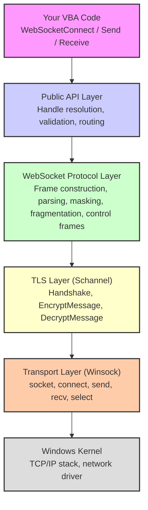

Wasabi is dual-architecture compatible: all Win32 API declarations are guarded by `#If VBA7 Then ... #Else ... #End If` blocks so that the same source file runs on both 32-bit (`Long`) and 64-bit (`LongPtr`) VBA hosts without modification.

## Connection Pool

Wasabi manages all connections through a statically allocated pool of 64 `WasabiConnection` entries. Each entry holds the complete state of one session, whether WebSocket or raw TCP.

### Structure

The pool is an array of `WasabiConnection` user-defined types, initialized on the first call to any Wasabi function via `InitConnectionPool`.

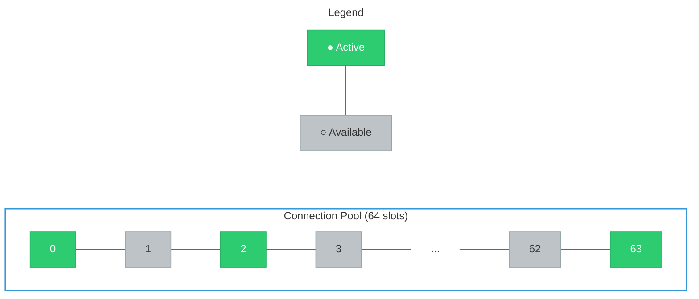

### Allocation

When `WebSocketConnect` or `TcpConnect` is called, `AllocConnection` scans the pool for the first slot where `Connected = False` and `Socket = INVALID_SOCKET`. It initializes all fields to their defaults and returns the slot index as the connection handle.

### Deallocation

When `WebSocketDisconnect` or `TcpDisconnect` is called, `CleanupHandle` closes the socket, releases TLS resources, and resets all fields in the slot. The slot becomes immediately available for reuse.

### Handle Resolution

Most public functions accept an optional `handle` parameter. The internal function `ResolveHandle` translates it according to the following rule:

```
If handle = INVALID_CONN_HANDLE (-1)
    → use m_DefaultHandle
Else
    → use the provided handle directly
```

> [!NOTE]
> The default handle is updated automatically by `WebSocketConnect` and `TcpConnect` to point to the most recently opened connection, so single-connection scripts require no explicit handle management.

### Per-Connection State

Each `WasabiConnection` entry contains:

| Category | Fields |
|:---|:---|
| Socket | `Connected`, `TLS`, `Host`, `Port`, `Path` |
| TLS | `hCred`, `hContext`, `Sizes`, `hNtlmCred` |
| Receive | `RecvBuffer()`, `RecvLen`, `DecryptBuffer()`, `DecryptLen` |
| Text Queue | `MsgQueue()`, `MsgHead`, `MsgTail`, `MsgCount` |
| Binary Queue | `BinaryQueue()`, `BinaryHead`, `BinaryTail`, `BinaryCount` |
| Offline Queue | `OfflineQueueEnabled`, `OfflineTextQueue()`, `OfflineTextCount`, `OfflineBinaryQueue()`, `OfflineBinaryCount` |
| Fragmentation | `FragmentBuffer()`, `FragmentLen`, `FragmentOpcode`, `Fragmenting` |
| Reconnect | `AutoReconnect`, `ReconnectMaxAttempts`, `ReconnectAttempts`, `ReconnectBaseDelayMs` |
| Proxy | `ProxyHost`, `ProxyPort`, `ProxyUser`, `ProxyPass`, `ProxyEnabled`, `ProxyType`, `ProxyUseNtlm` |
| Heartbeat | `PingIntervalMs`, `CurrentPingIntervalMs`, `PingJitterMaxMs`, `LastPingSentAt`, `LastPingTimestamp` |
| Timeouts | `ReceiveTimeoutMs`, `InactivityTimeoutMs`, `LastActivityAt` |
| Headers | `CustomHeaders()`, `CustomHeaderCount`, `SubProtocol` |
| Statistics | `Stats` (BytesSent, BytesReceived, MessagesSent, MessagesReceived, ConnectedAt) |
| Diagnostics | `LastError`, `LastErrorCode`, `TechnicalDetails`, `LastRttMs` |
| Logging | `LogCallback`, `EnableErrorDialog` |
| MTU | `CurrentMTU`, `MaxSegmentSize`, `OptimalFrameSize`, `LastProbeTime`, `ProbeEnabled`, `UseTLSFragmentation` |
| Security | `ValidateServerCert`, `EnableRevocationCheck`, `ClientCertThumb`, `ClientCertPfxPath`, `ClientCertPfxPass` |
| Compression | `DeflateEnabled`, `DeflateActive`, `DeflateContextTakeover`, `DeflateWindowBits`, `DeflateReady` |
| MQTT | `MqttParserStage`, `MqttBuffer()`, `MqttBufLen`, `MqttExpectedRemaining`, `MqttCurrentPacketType`, `MqttCurrentFlags`, `MqttInFlight()`, `MqttInFlightCount`, `MqttNextPacketId` |
| Extensions | `ProtocolHandler`, `CompressionHandler`, `MiddlewareHandler` |
| Configuration | `NoDelay`, `CustomBufferSize`, `CustomFragmentSize`, `OriginalUrl`, `AutoMTU`, `PreferIPv6`, `ZeroCopyEnabled` |

## Connection Sequence

The full connection sequence is handled by the internal `ConnectHandle` function. Every connection, including automatic reconnections, passes through this same path.

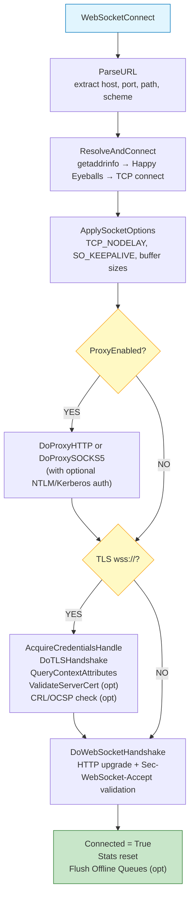

### Happy Eyeballs (RFC 6555)

The connection phase implements the Happy Eyeballs algorithm for dual-stack hosts. When both IPv6 and IPv4 addresses are resolved:

1. An IPv6 socket is created, set to non-blocking, and `connect()` is called immediately.
2. A 250 ms race window starts. If IPv6 connects within this time, it wins.
3. If the window expires, an IPv4 socket is also created and both compete.
4. The first socket to complete `connect()` wins; the other is closed.
5. If only one address family is available, it is used directly without the race.

This guarantees the fastest possible connection while preferring IPv6 when both are equally responsive. The race delay is controlled by the constant `HAPPY_EYEBALLS_DELAY_MS = 250`.

## TLS Handshake

The TLS layer is implemented through the Windows SSPI Schannel provider via `secur32.dll`. Wasabi performs the entire handshake manually rather than delegating to WinHTTP or any higher-level abstraction.

### Credential Acquisition

Before the handshake begins, Wasabi initializes a `SCHANNEL_CRED` structure with the following configuration:

| Field | Value | Purpose |
|:---|:---|:---|
| `dwVersion` | `SCHANNEL_CRED_VERSION` (4) | Structure version |
| `grbitEnabledProtocols` | `SP_PROT_TLS1_2_CLIENT \| SP_PROT_TLS1_3_CLIENT` | Accepted TLS versions |
| `dwFlags` | `SCH_CRED_NO_DEFAULT_CREDS` | Do not use Windows credential store |
| `dwFlags` | `SCH_CRED_MANUAL_CRED_VALIDATION` | Skip automatic certificate chain validation |
| `dwFlags` | `SCH_CRED_IGNORE_NO_REVOCATION_CHECK` | Do not fail if CRL is unavailable (unless revocation check is enabled) |
| `dwFlags` | `SCH_CRED_IGNORE_REVOCATION_OFFLINE` | Do not fail if CRL server is unreachable (unless revocation check is enabled) |

This credential is passed to `AcquireCredentialsHandle` with the package name `"Microsoft Unified Security Protocol Provider"`.

> [!IMPORTANT]
> Certificate revocation checking (CRL/OCSP) is configurable via `WebSocketSetRevocationCheck`. When disabled (the default), Wasabi passes `SCH_CRED_IGNORE_NO_REVOCATION_CHECK` and `SCH_CRED_IGNORE_REVOCATION_OFFLINE` to maximize compatibility with firewalled and offline corporate environments. When enabled, these flags are removed and `CertGetCertificateChain` is called with `CERT_CHAIN_REVOCATION_CHECK_CHAIN`.

### Handshake Loop

The handshake is a multi-round exchange between client and server. The internal function `DoTLSHandshake` implements this as a loop protected by a maximum iteration count of 30 to prevent infinite loops on malformed server responses.

```
Round 1: InitializeSecurityContext (first call, no input)
         → sends ClientHello
         → receives ServerHello + Certificate + ServerHelloDone

Round 2: InitializeSecurityContext (with server response)
         → sends ClientKeyExchange + ChangeCipherSpec + Finished
         → receives server ChangeCipherSpec + Finished

Result:  SEC_E_OK → handshake complete
```

Each round follows this pattern:

1. Call `InitializeSecurityContext` with the accumulated server data.
2. If an output token is produced, send it to the server via `sock_send`.
3. If the result is `SEC_I_CONTINUE_NEEDED`, read more data from the server.
4. If the result is `SEC_E_INCOMPLETE_MESSAGE`, read more data and retry without advancing.
5. If any `SECBUFFER_EXTRA` is returned, preserve those bytes for the next round.
6. If the result is `SEC_E_OK`, the handshake is complete.

### TLS Renegotiation

Wasabi explicitly does not support server-initiated TLS renegotiation. If `DecryptMessage` returns `SEC_I_RENEGOTIATE`, the connection is closed with error `ERR_TLS_RENEGOTIATE` and, if auto-reconnect is enabled, a new connection is established automatically.

> [!NOTE]
> TLS renegotiation is rarely used by modern servers. Auto-reconnect serves as the practical recovery path in the single-threaded VBA environment.

### Post-Handshake

After the handshake completes, Wasabi calls `QueryContextAttributes` with `SECPKG_ATTR_STREAM_SIZES` to retrieve:

| Field | Purpose |
|:---|:---|
| `cbHeader` | Size of the TLS record header prepended to each encrypted block |
| `cbTrailer` | Size of the TLS record trailer appended to each encrypted block |
| `cbMaximumMessage` | Maximum plaintext size per TLS record |

These values are used by `TLSSend` to correctly frame outgoing data.

## TLS Data Flow

### Encryption (Sending)

When `TLSSend` is called with plaintext data:

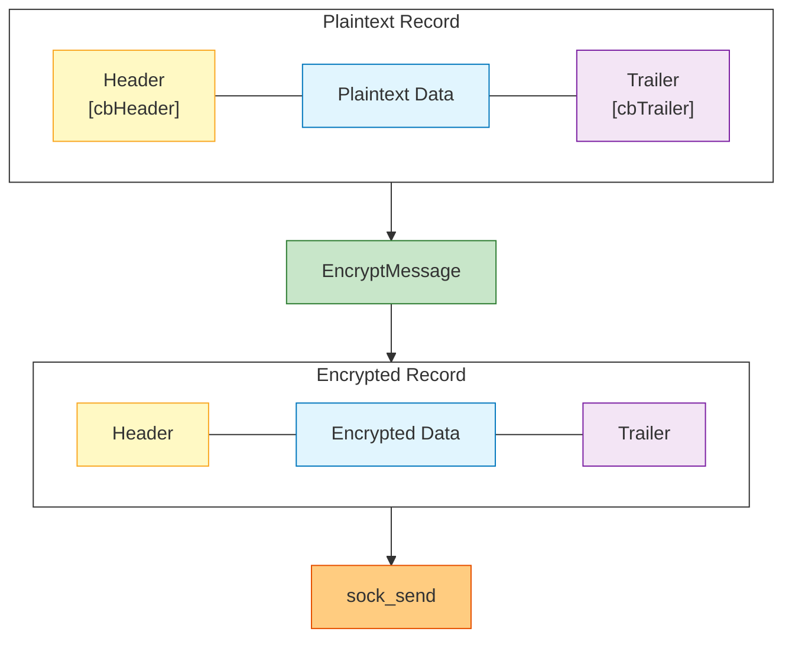

`TLSSend` automatically splits data larger than `cbMaximumMessage` into multiple TLS records, each encrypted separately and sent sequentially.

### Decryption (Receiving)

When `TLSDecrypt` processes buffered data:

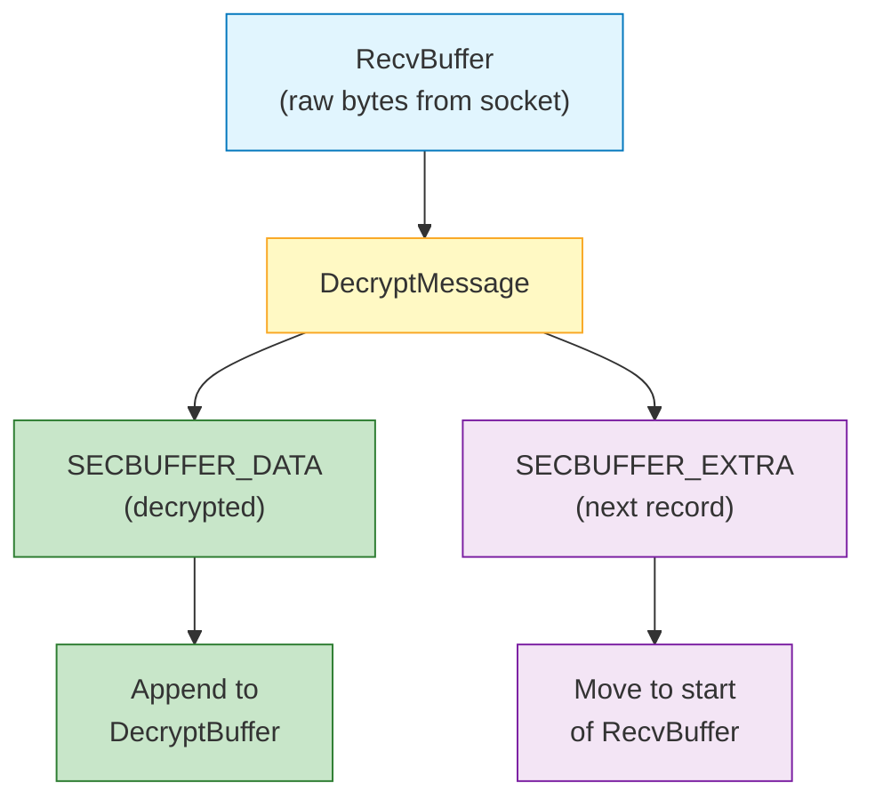

The `SECBUFFER_EXTRA` handling is critical: when the OS delivers multiple TLS records in a single `recv()` call, `DecryptMessage` only processes the first complete record and marks the remainder as `SECBUFFER_EXTRA`. Wasabi moves those bytes to the beginning of `RecvBuffer` and loops to decrypt again.

> [!NOTE]
> If `DecryptMessage` returns `SEC_E_INCOMPLETE_MESSAGE`, the current `RecvBuffer` does not yet contain a complete TLS record. Wasabi exits the decrypt loop and waits for more data on the next polling cycle.

## WebSocket Handshake

After TCP (and optional TLS) is established, Wasabi performs the WebSocket protocol upgrade as defined by [RFC 6455 Section 4](https://datatracker.ietf.org/doc/html/rfc6455#section-4).

### Request

Wasabi constructs and sends an HTTP/1.1 GET request:

```http
GET /path HTTP/1.1
Host: example.com
Upgrade: websocket
Connection: Upgrade
Sec-WebSocket-Key: dGhlIHNhbXBsZSBub25jZQ==
Sec-WebSocket-Version: 13
Origin: https://example.com
User-Agent: Mozilla/5.0 (Windows NT 10.0; Win64; x64) AppleWebKit/537.36
```

The `Sec-WebSocket-Key` is a Base64-encoded 16-byte random value generated by `GenerateWSKey`. Wasabi uses `RtlGenRandom` (exported as `SystemFunction036` from `advapi32.dll`) to obtain cryptographically strong random bytes. If `RtlGenRandom` were to fail, the code falls back to the VBA `Rnd` function.

If custom headers, a subprotocol, compression extensions, or proxy credentials are configured, they are appended before the final blank line.

### Response Validation

Wasabi validates the server response in two steps.

**Status code check:** the response must contain HTTP status `101 Switching Protocols`. Any other status triggers `ERR_HANDSHAKE_REJECTED`.

**Accept key validation:** Wasabi computes the expected accept value as:

```
expected = Base64(SHA1(key + "258EAFA5-E914-47DA-95CA-C5AB0DC85B11"))
```

This is compared against the `Sec-WebSocket-Accept` header in the server response. A mismatch triggers `ERR_HANDSHAKE_REJECTED`.

SHA-1 is computed via `CryptCreateHash` / `CryptHashData` / `CryptGetHashParam` from `advapi32.dll`, requiring no external library. See the [SHA-1 section](#sha-1) below.

### permessage-deflate

If `DeflateEnabled` is set (either via `WebSocketSetDeflate` or the `DeflateEnabled` parameter of `WebSocketConnect`), Wasabi appends a `Sec-WebSocket-Extensions: permessage-deflate` header to the upgrade request, negotiating compression with the server. The server response is parsed by `ParseDeflateResponse`, which reads the agreed-upon parameters (`context_takeover`, `max_window_bits`) and sets `DeflateActive = True` if the extension was accepted.

## Frame Processing

WebSocket communication happens through frames as defined by [RFC 6455 Section 5](https://datatracker.ietf.org/doc/html/rfc6455#section-5).

### Frame Format

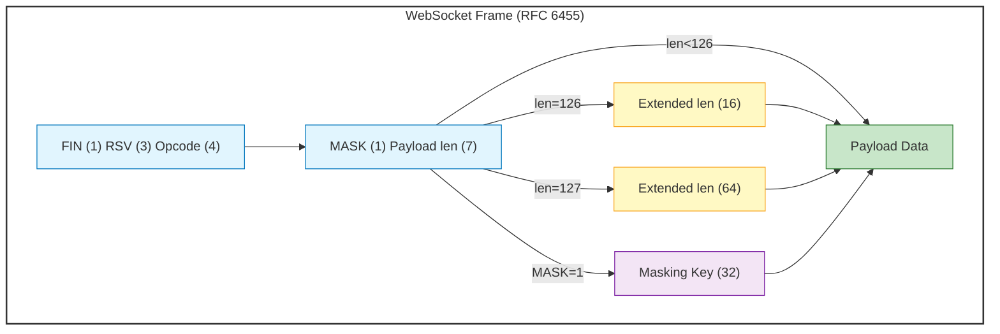

### Outgoing Frames (Sending)

When `WebSocketSend` or `WebSocketSendBinary` is called:

1. The payload size is measured in bytes (UTF-8 for text, raw for binary).
2. A 4-byte cryptographically random mask key is generated via `RtlGenRandom` through `FillRandomBytes`.
3. The frame header is constructed with the FIN bit set, the appropriate opcode (`0x01` for text, `0x02` for binary), and the MASK bit set.
4. The payload length is encoded in the appropriate tier (7-bit, 16-bit, or 64-bit).
5. Each payload byte is XORed with `mask(i Mod 4)`.
6. The complete frame is delivered via `RawSendFor` (plain TCP) or `TLSSend` (TLS).

> [!NOTE]
> The RSV1 bit (`0x40`) is reserved for `permessage-deflate` support. `BuildWSFrame` already accepts an optional `rsv1` parameter for this purpose, and Wasabi sets it when `DeflateActive` is true and the message is being sent compressed.

### Incoming Frames (Receiving)

The internal function `ProcessFrames` parses frames from `DecryptBuffer`:

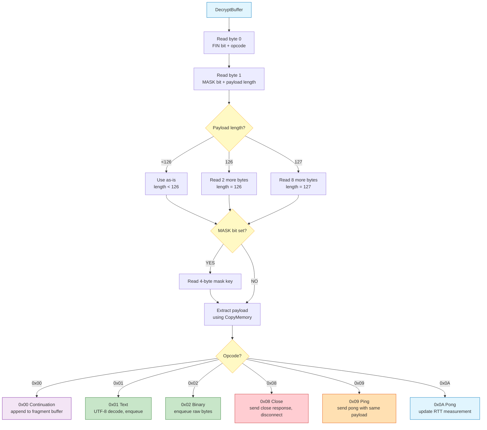

### Fragmentation

Large messages may arrive split across multiple frames. The first frame has a non-zero opcode with the FIN bit cleared. Continuation frames use opcode `0x00`. The final frame has the FIN bit set.

```
Frame 1: FIN=0, opcode=0x01 (Text), payload="Hello "
Frame 2: FIN=0, opcode=0x00 (Continuation), payload="from "
Frame 3: FIN=1, opcode=0x00 (Continuation), payload="Wasabi"

Result: "Hello from Wasabi"
```

Wasabi accumulates fragments in the per-connection `FragmentBuffer` using `CopyMemory`. When the final FIN frame arrives, the complete payload is assembled and enqueued as a single message.

> [!NOTE]
> The fragment buffer starts at 256 KB and grows automatically as needed. The maximum size can be configured via `WebSocketSetBufferSizes` before connecting. If a fragmented message exceeds this limit, the connection is closed with `ERR_FRAGMENT_OVERFLOW`.

## Message Queues

Each connection maintains two independent circular queues (ring buffers): one for text messages and one for binary messages. Both have a fixed capacity of 512 entries (`MSG_QUEUE_SIZE`).

### Structure

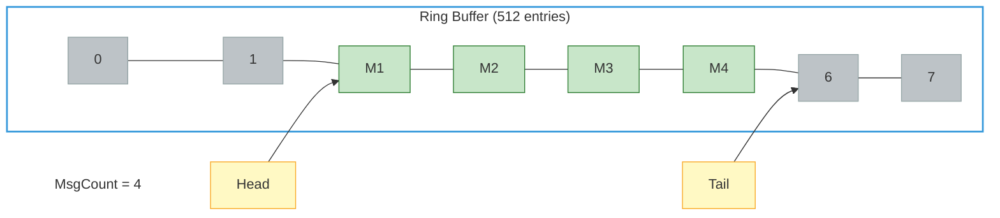

### Operations

**Enqueue (new message arrives):**
```
MsgQueue(MsgTail) = message
MsgTail = (MsgTail + 1) Mod MSG_QUEUE_SIZE
MsgCount = MsgCount + 1
```

**Dequeue (`WebSocketReceive` called):**
```
result = MsgQueue(MsgHead)
MsgHead = (MsgHead + 1) Mod MSG_QUEUE_SIZE
MsgCount = MsgCount - 1
```

Both operations are O(1) with no dynamic allocation beyond the initial array setup.

> [!WARNING]
> When `MsgCount` reaches `MSG_QUEUE_SIZE` (512), new messages are discarded and a warning is logged. Call `WebSocketReceive` frequently enough to drain the queue, or increase the polling rate.

### Offline Retention Queue

If `WebSocketSetOfflineQueueing` is enabled, Wasabi maintains a secondary set of dynamic queues (`OfflineTextQueue` and `OfflineBinaryQueue`). While the connection is in a disconnected state, calls to `WebSocketSend` or `WebSocketSendBinary` push messages to these queues instead of returning an error. Once `AutoReconnect` successfully re-establishes the connection, `FlushOfflineQueues` is called automatically to replay all buffered messages in order.

## Receive Pipeline

The complete data flow from network to your code:

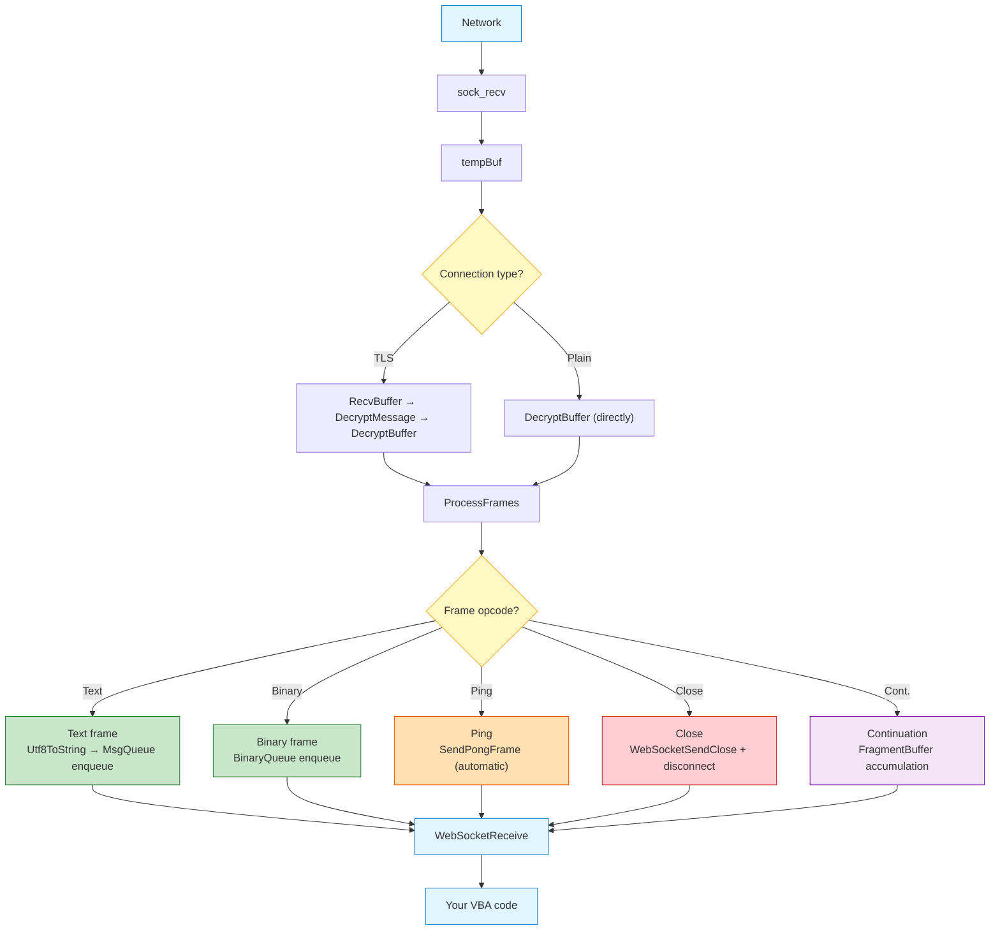

### Buffer Sizes

| Buffer | Default Size | Configurable |
|:---|:---|:---|
| `RecvBuffer` | 4 KB (auto-grows) | Yes, via `WebSocketSetBufferSizes` |
| `DecryptBuffer` | 4 KB (auto-grows) | Yes, via `WebSocketSetBufferSizes` |
| `FragmentBuffer` | 4 KB (auto-grows) | Yes, via `WebSocketSetBufferSizes` |
| Text queue | 512 entries | No (compile-time constant) |
| Binary queue | 512 entries | No (compile-time constant) |

## Auto-Reconnect

When a connection loss is detected during polling and auto-reconnect is enabled (`WebSocketSetAutoReconnect`), Wasabi executes the following sequence:

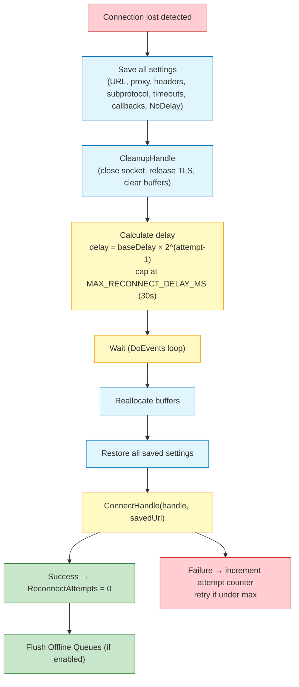

### Backoff Pattern

| Attempt | Delay (base = 1000 ms) |
|:---|:---|
| 1 | 1000 ms |
| 2 | 2000 ms |
| 3 | 4000 ms |
| 4 | 8000 ms |
| 5 | 16000 ms |
| 6+ | 30000 ms (capped) |

> [!IMPORTANT]
> The reconnect delay loop uses `DoEvents`, which yields to the Windows message pump but does not fully release the VBA thread. The Office UI remains partially responsive during the wait.

## SHA-1

Wasabi computes SHA-1 for the `Sec-WebSocket-Accept` header as required by [RFC 6455 Section 4.2.2](https://datatracker.ietf.org/doc/html/rfc6455#section-4.2.2). Rather than a pure-VBA implementation, Wasabi delegates to the Windows Crypto API: `CryptAcquireContext`, `CryptCreateHash` (with `CALG_SHA1 = 0x8004`), `CryptHashData`, and `CryptGetHashParam`, all from `advapi32.dll`. This keeps the implementation correct, fast, and dependency-free within the same `.bas` file constraint.

## Extension System

Wasabi supports a lightweight object-based extension system for advanced use cases. Three hooks are available per connection:

| Function | Purpose |
|:---|:---|
| `WasabiUseProtocol(ext, handle)` | Attaches a protocol handler object (`ProtocolHandler`) |
| `WasabiUseCompression(ext, handle)` | Attaches a compression handler object (`CompressionHandler`) |
| `WasabiUseMiddleware(ext, handle)` | Attaches a middleware object (`MiddlewareHandler`) |

Each extension object is called via `OnConnect` when it is registered against an active connection. Extensions are stored per-connection in the pool and are independent across handles.

## Proxy Tunnel

When a proxy is configured, Wasabi establishes an HTTP CONNECT or SOCKS5 tunnel before performing TLS or WebSocket handshaking. Both proxy types support authentication.

### HTTP Proxy with NTLM/Kerberos

For corporate environments requiring integrated Windows authentication, Wasabi supports NTLM/Kerberos via `WebSocketSetProxyNtlm`. When enabled and the proxy returns `407 Proxy Authentication Required` with `Proxy-Authenticate: NTLM` (or `Negotiate`), Wasabi performs a full SSPI NTLM handshake via `GenerateNtlmToken`, using `AcquireCredentialsHandle` with the `"NTLM"` package and `InitializeSecurityContext` to produce a token sent in the `Proxy-Authorization: NTLM <base64>` header.

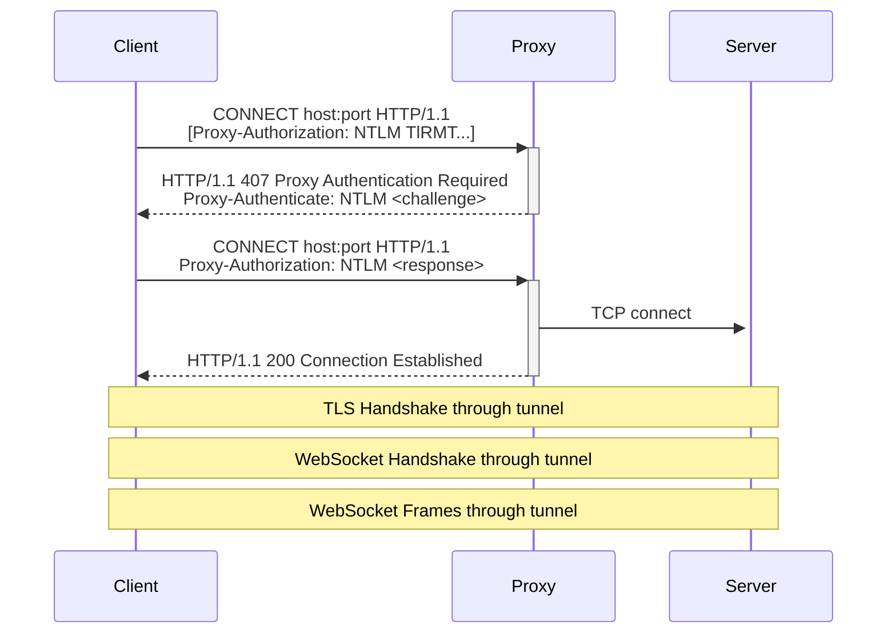

> [!NOTE]
> The proxy only sees the CONNECT request. After the tunnel is established, all subsequent traffic (TLS, WebSocket frames) passes through opaquely. The proxy cannot inspect the encrypted content.

Proxy auto-discovery is also available via `WebSocketAutoDiscoverProxy` and `TcpAutoDiscoverProxy`, which read the current IE/WinHTTP proxy configuration using `WinHttpGetIEProxyConfigForCurrentUser`.

## RTT Latency Measurement

Wasabi provides round-trip time measurement through `WebSocketGetLatency`. When `WebSocketSendPing` is called, the current tick count is stored in `LastPingTimestamp`. When a Pong frame arrives, `ProcessPongForLatency` calculates the elapsed time and stores it in `LastRttMs`.

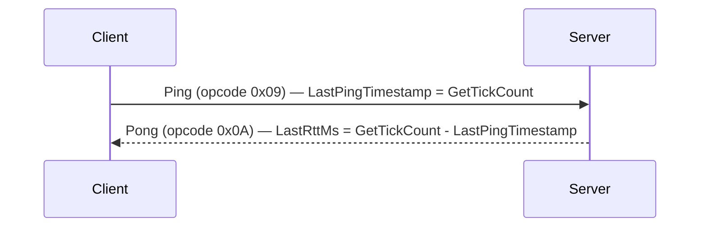

> [!NOTE]
> RTT values are updated on every Pong frame received, including automatic pongs triggered by the server's response to periodic pings configured via `WebSocketSetPingInterval`. Jitter can be applied to the ping interval via the `jitterMaxMs` parameter to avoid synchronized pings across multiple connections.

## MQTT over WebSocket

Wasabi includes a minimal MQTT 3.1.1 client that operates over the existing WebSocket transport. This enables direct integration with IoT brokers such as Mosquitto, HiveMQ, and AWS IoT from any VBA host.

### Supported Operations

| Function | MQTT Packet | Description |
|:---|:---|:---|
| `MqttConnect` | CONNECT | Authenticates and establishes an MQTT session |
| `MqttPublish` | PUBLISH | Sends a message to a topic with QoS 0, 1, or 2 |
| `MqttSubscribe` | SUBSCRIBE | Subscribes to one or more topics |
| `MqttUnsubscribe` | UNSUBSCRIBE | Removes a topic subscription |
| `MqttDisconnect` | DISCONNECT | Gracefully terminates the MQTT session |
| `MqttPingReq` | PINGREQ | Sends a keep-alive ping |
| `MqttReceive` | — | Polls for and parses incoming packets; automatically handles QoS 1 and 2 acknowledgments (PUBACK, PUBREC, PUBREL, PUBCOMP) |

### Internal Architecture

The MQTT subsystem reuses the existing WebSocket connection. MQTT packets are built as binary WebSocket frames and sent via `WebSocketSendBinary`. Incoming binary frames are fed byte-by-byte into `MqttParseByte`, a state machine that decodes the MQTT fixed header, remaining length, and variable payload.

Parser state is stored per-connection in `MqttParserStage`, `MqttBuffer`, and related fields. QoS 1 and 2 delivery is guaranteed via an internal in-flight queue and packet ID tracking stored in `MqttInFlight` and `MqttNextPacketId`.

## Maintenance Cycle

Every call to `WebSocketReceive` triggers an internal maintenance pass via `TickMaintenance`. This is the only mechanism for time-based features because VBA does not support background timers.

| Check | Condition | Action |
|:---|:---|:---|
| Automatic Ping | `PingIntervalMs > 0` and `CurrentPingIntervalMs` elapsed | Send Ping frame, record RTT timestamp, calculate next interval (with optional jitter) |
| Inactivity Timeout | `InactivityTimeoutMs > 0` and threshold exceeded | Close connection, trigger reconnect if enabled |
| MTU Probe | `AutoMTU` and `ProbeEnabled` and `PMTU_DISCOVERY_INTERVAL_MS` elapsed | Call `ProbeMTU` to re-measure MSS |

> [!IMPORTANT]
> If your code stops calling `WebSocketReceive`, maintenance also stops. Automatic pings will not be sent and inactivity timeouts will not fire.

## Memory Layout

Wasabi uses pre-allocated byte arrays instead of dynamic string concatenation to minimize heap fragmentation in long-running sessions.

```
Per-connection memory footprint (default settings):

  RecvBuffer:      4 KB (auto-grows up to CustomBufferSize)
  DecryptBuffer:   4 KB (auto-grows up to CustomBufferSize)
  FragmentBuffer:  4 KB (auto-grows up to CustomFragmentSize)
  MsgQueue:        512 × String pointer
  BinaryQueue:     512 × Byte array pointer
  CustomHeaders:   32 × String pointer
  MqttBuffer:      4 KB

  Total baseline: ~36 KB + queue overhead per connection
```

> [!NOTE]
> Actual memory consumed depends on the size of queued messages and dynamically grown buffers. The baseline above represents fixed allocations before any large messages are received.

## Error Propagation

Errors propagate through two parallel paths:

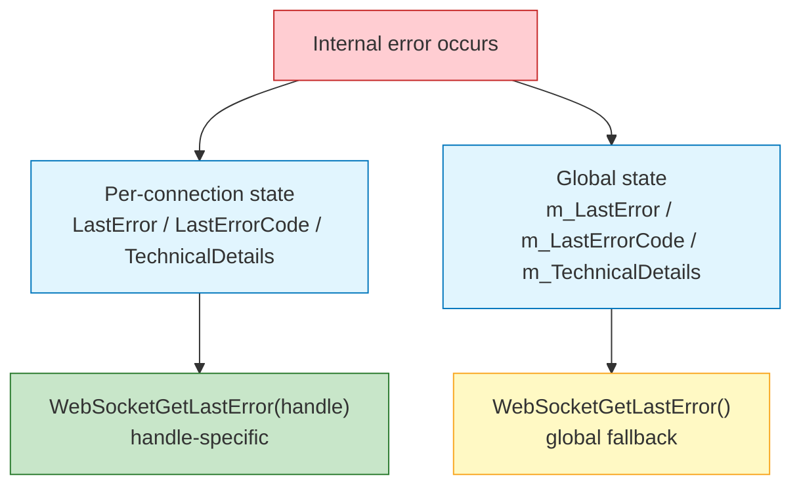

When a function is called with a valid handle, the per-connection error state is returned. When called without a handle or with an invalid handle, the global error state is returned. Always pass the handle when checking errors to get the most specific information available.

### Error Codes

| Code | Name | Description |
|:---|:---|:---|
| 0 | `ERR_NONE` | No error |
| 1 | `ERR_WSA_STARTUP_FAILED` | `WSAStartup` failed |
| 2 | `ERR_SOCKET_CREATE_FAILED` | `socket()` returned invalid handle |
| 3 | `ERR_DNS_RESOLVE_FAILED` | `getaddrinfo()` could not resolve host |
| 4 | `ERR_CONNECT_FAILED` | TCP connection could not be established |
| 5 | `ERR_TLS_ACQUIRE_CREDS_FAILED` | `AcquireCredentialsHandle` failed |
| 6 | `ERR_TLS_HANDSHAKE_FAILED` | `InitializeSecurityContext` returned fatal error |
| 7 | `ERR_TLS_HANDSHAKE_TIMEOUT` | TLS handshake exceeded iteration limit or timeout |
| 8 | `ERR_WEBSOCKET_HANDSHAKE_FAILED` | Could not send or receive HTTP upgrade |
| 9 | `ERR_WEBSOCKET_HANDSHAKE_TIMEOUT` | No response to upgrade request |
| 10 | `ERR_SEND_FAILED` | `send()` returned zero or negative |
| 11 | `ERR_RECV_FAILED` | `recv()` returned negative value |
| 12 | `ERR_NOT_CONNECTED` | Operation attempted on disconnected handle |
| 13 | `ERR_ALREADY_CONNECTED` | Reserved for future use |
| 14 | `ERR_TLS_ENCRYPT_FAILED` | `EncryptMessage` failed |
| 15 | `ERR_TLS_DECRYPT_FAILED` | `DecryptMessage` failed (non-renegotiation) |
| 16 | `ERR_INVALID_URL` | URL could not be parsed |
| 17 | `ERR_HANDSHAKE_REJECTED` | Server rejected WebSocket upgrade |
| 18 | `ERR_CONNECTION_LOST` | Connection dropped during operation |
| 19 | `ERR_INVALID_HANDLE` | Handle out of valid range |
| 20 | `ERR_MAX_CONNECTIONS` | Pool exhausted (64 connections) |
| 21 | `ERR_PROXY_CONNECT_FAILED` | Could not reach proxy |
| 22 | `ERR_PROXY_AUTH_FAILED` | Proxy returned 407 (or SOCKS5 auth rejected) |
| 23 | `ERR_PROXY_TUNNEL_FAILED` | Proxy rejected CONNECT |
| 24 | `ERR_INACTIVITY_TIMEOUT` | No data received within inactivity window |
| 25 | `ERR_CERT_LOAD_FAILED` | Client certificate could not be loaded |
| 26 | `ERR_CERT_VALIDATE_FAILED` | Server certificate chain validation failed |
| 27 | `ERR_FRAGMENT_OVERFLOW` | Fragmented message exceeded buffer size |
| 28 | `ERR_TLS_RENEGOTIATE` | Server requested TLS renegotiation |

## Related Documentation

- [API Reference](API_REFERENCE.md) for the complete public API
- [Error Reference](ERRORS.md) for detailed error diagnostics
- [SECURITY.md](../SECURITY.md) for security design decisions
- [RFC 6455](https://datatracker.ietf.org/doc/html/rfc6455) for the WebSocket protocol specification
- [SSPI/Schannel documentation](https://learn.microsoft.com/en-us/windows/win32/secauthn/sspi) for the TLS implementation reference
- [Winsock documentation](https://learn.microsoft.com/en-us/windows/win32/winsock/winsock-functions) for the transport layer reference
